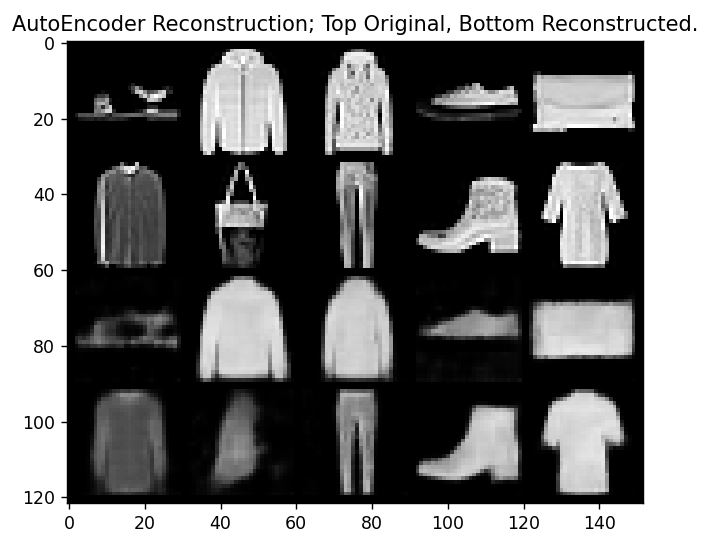
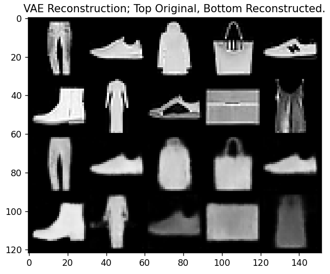

# VAE and GAN variants

This repository experiments with VAE, GAN and VAE/GAN architectures on the Fashion MNIST dataset.

## Requirements

`torch, torchvision, tqdm, matplotlib`

It is recommended to use PyTorch with GPU ability to train model. 

## How to use it

Currently only AutoEncoder, VAE are implemented, while possible to add more features in the future, 
it can be used without issue. 

To train an AutoEncoder, run the code below. 
```
python ae.py --train --dataset MNIST --model-path my_ae.pth
python ae.py --train --dataset MNIST --model-path my_ae.pth --seed 100
```
Trained model will be saved in `./models/{provided_path}`. 
Training will also generate a png image showing metrics. 
You may provide seed to ensure reproducibility.
Run `python ae.py -h` to see a list of available dataset arguments. 

Our evaluation takes 10 random images from the validation dataset,
then plot them against their reconstructions. 
Use seed to ensure reproducibility.
```
python ae.py --model-path --dataset MNIST my_ae.pth
python ae.py --model-path --dataset MNIST my_ae.pth --seed 100
```



To train a VAE, the command is similar, only difference is to use the `vae.py` script
while the model will be saved as `best_vae.pth` by default. 
For VAE, loss function graphs will be plotted separately for reconstruction loss
and latent loss. 
Unfortunately, based on unknown reason latent loss isn't decreasing, more
experiments will be conducted. 
Comparing results from AutoEncoder and VAE does not shows significant improvement. 